# Assignment #3 — Responsive Web Design

**Name:** Dinislam Mirzadiyar  
**Group:** IT-2503  
**Topic:** Media Queries + Bootstrap Grid

## Part 1. Media Queries

### Task 0. Responsive Typography

I created a simple section with a heading and paragraph. CSS media queries change the font sizes for desktop, tablet, and mobile screens.

**Screenshot:**

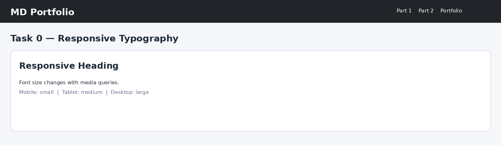

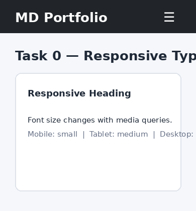

### Task 1. Responsive Layout with Media Queries

Three boxes are arranged with CSS Grid and media queries. On desktop they appear in one row, on tablet there are two boxes in the first row and one in the second row, and on mobile all boxes are stacked.

**Screenshot:**

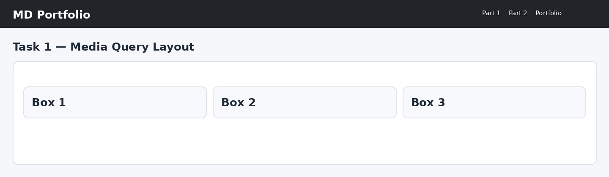

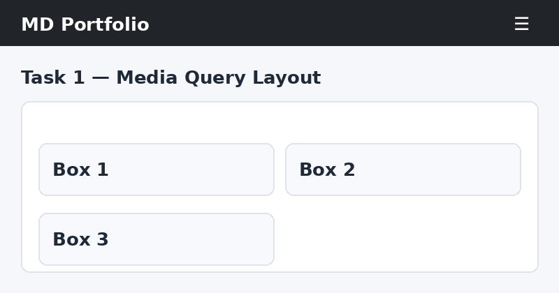

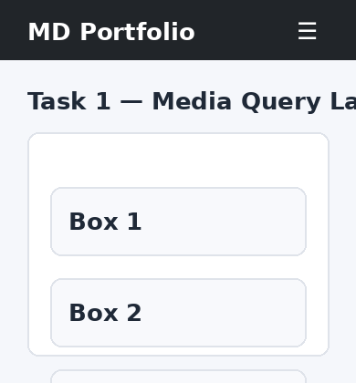

## Part 2. Bootstrap Grid System

### Task 2. Bootstrap Responsive Columns

The Bootstrap 12-column grid is used with `col-12 col-md-6 col-lg-4`. This creates one column on mobile, two columns on tablet, and three equal columns on desktop.

**Screenshot:**

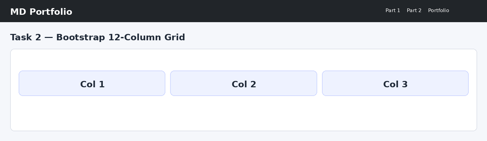

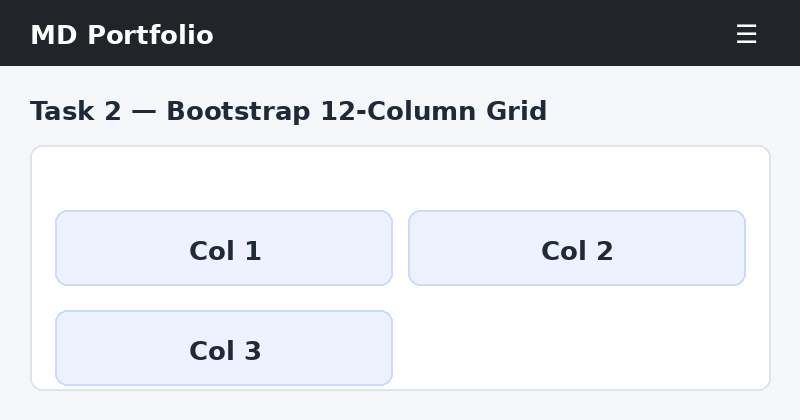

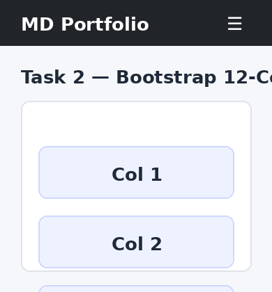

### Task 3. Bootstrap Navigation Bar

I used Bootstrap's responsive navbar component. The logo is on the left, navigation links are on the right on larger screens, and the links collapse into a hamburger menu on small screens.

**Screenshot:**

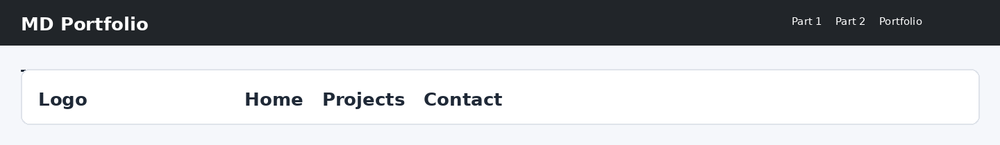

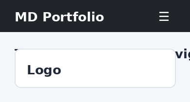

## Part 3. Combined Project

### Task 4. Responsive Portfolio Page

The portfolio combines Bootstrap and custom media queries. The header uses a Bootstrap navbar, the project area uses Bootstrap cards and grid columns, and the right side contains a personal information sidebar. Custom media queries change typography, spacing, and visibility for different screen sizes.

**Screenshot:**

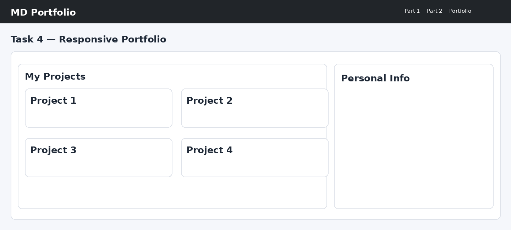

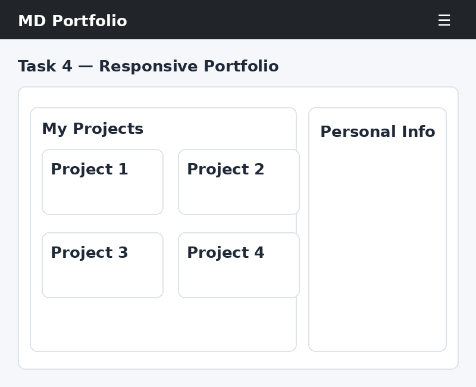

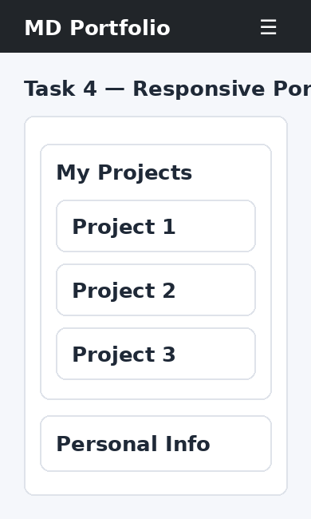

## Work Process Summary

1. Created a responsive HTML page with separate sections for all assignment tasks.
2. Added custom CSS media queries for desktop, tablet, and mobile layouts.
3. Added Bootstrap 5.3 and used its 12-column grid and navbar components.
4. Combined Bootstrap Grid with custom CSS in the portfolio section.
5. Tested the page at different viewport sizes and added screenshots to this README.
6. The complete project can be uploaded to a public GitHub repository.

## Technologies

- HTML5
- CSS3
- CSS Media Queries
- Bootstrap 5.3
